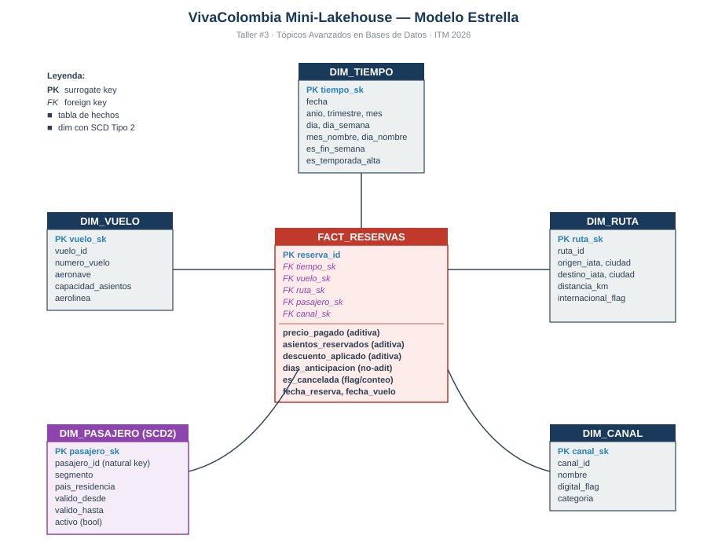
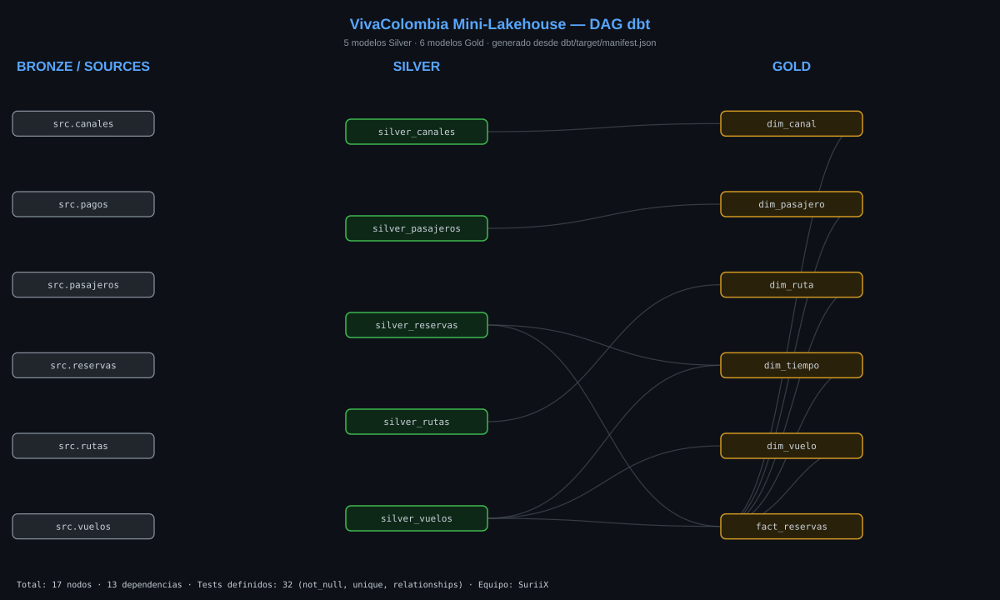
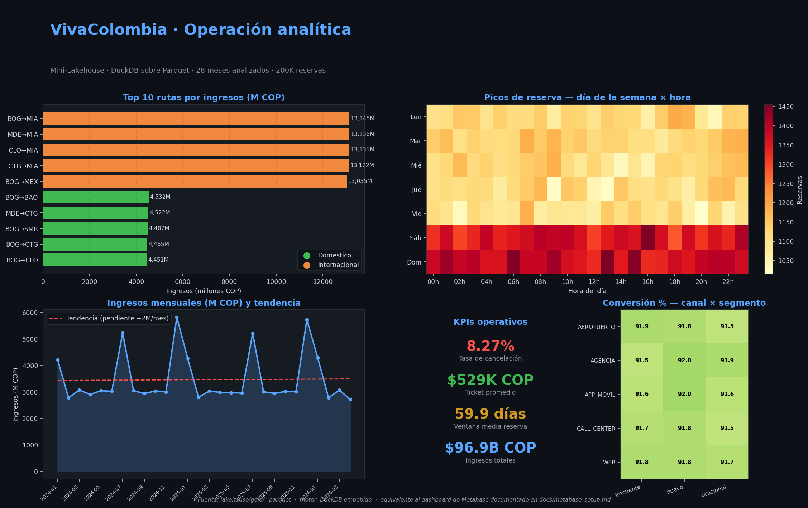

# VivaColombia · Mini-Lakehouse

> **Taller #3 — Tópicos Avanzados en Bases de Datos · ITM 2026**
> Docente: Roberto Carlos Rahamut Suteu
> Equipo: **Juan Pablo Cañas Sepúlveda** · **Owen David Pérez Sánchez**

---

## Descripción

Este proyecto extiende el sistema operacional **VivaColombia** (reservas aéreas Bogotá–Miami sobre **CockroachDB + Redis**, construido en los Módulos 1 y 2) con una **capa analítica profesional mínima**: un Mini-Lakehouse con zonas Bronze, Silver y Gold sobre archivos Parquet, consultado con DuckDB y opcionalmente con dbt-duckdb + Metabase.

El proceso de negocio modelado es **comportamiento de reservas confirmadas por ruta, canal y período**, con granularidad de *una fila = una reserva*.

## Arquitectura



```
OLTP (CockroachDB / Redis) → Bronze (Parquet raw) → Silver (limpio)
  → Gold (modelo estrella) → DuckDB / dbt / Metabase
```

| Componente            | Herramienta                          |
|-----------------------|--------------------------------------|
| Almacenamiento Lake   | Parquet en `lakehouse/{bronze,silver,gold}/` |
| Motor analítico       | DuckDB embebido                      |
| Pipeline ETL base     | Python (`scripts/extract.py`, `transform_silver.py`, `transform_gold.py`) |
| Pipeline ELT moderno  | **dbt-duckdb** (alternativa A)        |
| Visualización         | **Metabase Community** (alternativa B) |
| Benchmark             | SQLite (proxy OLTP row-store) vs DuckDB columnar |
| Control de versiones  | Git + GitHub                         |

## Estructura del repositorio

```
vivacolombia-lakehouse/
├── lakehouse/
│   ├── bronze/                # Parquet raw (extract.py)
│   ├── silver/                # Parquet limpios (transform_silver.py)
│   ├── gold/                  # Modelo estrella (transform_gold.py)
│   └── analytics.duckdb       # DB persistente (dbt + Metabase)
├── scripts/
│   ├── extract.py             # Bronze (CockroachDB o sintético con faker)
│   ├── transform_silver.py    # Silver
│   ├── transform_gold.py      # Gold (con SCD2 sobre dim_pasajero)
│   ├── analyze.py             # 5 consultas analíticas
│   ├── benchmark.py           # SQLite vs DuckDB
│   └── persist_for_metabase.py
├── dbt/
│   ├── dbt_project.yml
│   ├── profiles.yml
│   └── models/
│       ├── sources.yml
│       ├── silver/silver_*.sql
│       └── gold/{dim_*,fact_reservas,schema}.{sql,yml}
├── docs/
│   ├── diseno_dimensional.md       # respuestas a las 5 preguntas
│   ├── modelo_dimensional.svg      # diagrama estrella
│   ├── reporte_calidad_silver.txt  # reporte de calidad (rúbrica)
│   ├── benchmark_resultados.txt    # tabla con tiempos
│   └── metabase_setup.md           # cómo levantar Metabase
├── main.py                    # orquestador end-to-end
├── requirements.txt
└── README.md
```

## Requisitos

- Python 3.10+
- pip
- Docker (solo para Metabase, opcional)

```bash
pip install -r requirements.txt
```

## Ejecución del pipeline completo (un comando)

```bash
python main.py
```

Esto corre en orden:

1. `extract.py` — genera 500K reservas sintéticas (Plan B oficial,
   sección 5.3 de la guía) en `lakehouse/bronze/`.
2. `transform_silver.py` — limpia, deduplica y tipa.
3. `transform_gold.py` — construye modelo estrella con SCD Tipo 2
   en `dim_pasajero`.
4. `analyze.py` — corre 5 consultas analíticas con tiempos.
5. `benchmark.py` — compara SQLite vs DuckDB.

### Modo "datos reales" desde CockroachDB del Módulo 2

```bash
EXTRACT_MODE=cockroach \
DB_URL="postgresql://root@localhost:26257/vivacolombia_db?sslmode=disable" \
python main.py
```

`scripts/extract.py` ya tiene el código listo para CockroachDB; solo
cambia el modo y la URL.

### Variables de entorno disponibles

| Variable        | Default                                | Descripción                         |
|-----------------|----------------------------------------|-------------------------------------|
| `EXTRACT_MODE`  | `synthetic`                            | `synthetic` o `cockroach`           |
| `DB_URL`        | `postgresql://root@localhost:26257/...`| Solo para modo cockroach            |
| `N_RESERVAS`    | `500000`                               | Volumen sintético                   |
| `SYNTH_SEED`    | `42`                                   | Reproducibilidad de la generación   |

## Modelo dimensional

Documentación completa con justificaciones en
[`docs/diseno_dimensional.md`](docs/diseno_dimensional.md). Resumen:

- **`fact_reservas`** — 1 fila = 1 reserva
- **`dim_tiempo`** — calendario diario (Tipo 0)
- **`dim_vuelo`** — Tipo 1
- **`dim_ruta`** — Tipo 1, IATA + flag internacional
- **`dim_canal`** — Tipo 1, web/app/agencia/call_center/aeropuerto
- **`dim_pasajero`** — **Tipo 2** con `valido_desde`/`valido_hasta`/`activo`

## Reporte de calidad Silver

Ver [`docs/reporte_calidad_silver.txt`](docs/reporte_calidad_silver.txt).
Última corrida sobre 200K reservas sintéticas:

- 99.7% de filas retenidas
- 1,002 nulos en `canal_id` resueltos a default `CALL_CENTER`
- 200 filas con precio negativo eliminadas
- 400 duplicados (por `reserva_id`) eliminados
- $106,583,318,105 COP de monto total reservado

## Resultados del Benchmark

Mismo agregado mensual ejecutado en SQLite (row-store, proxy OLTP)
vs DuckDB (columnar leyendo Parquet):

| Query                          | SQLite (ms) | DuckDB (ms) | Factor |
|--------------------------------|------------:|------------:|-------:|
| Agregado mensual con GROUP BY  |      151.99 |       17.84 | **8.52x** |
| Full-scan COUNT + SUM          |       15.87 |        7.64 | **2.08x** |

**Lectura honesta:** con ~200K filas y un dataset que cabe en RAM, la ventaja columnar es moderada (~8x en agregados, ~2x en full-scan). El beneficio se dispara en datasets >1M filas y queries que escanean muchas filas pero pocas columnas, porque Parquet solo lee las columnas referenciadas y aprovecha compresión RLE/dictionary. Para escenarios reales VivaColombia (millones de reservas/año), el factor sería notablemente mayor.

Reporte completo: [`docs/benchmark_resultados.txt`](docs/benchmark_resultados.txt).

## Alternativa A — dbt Core sobre DuckDB

Las transformaciones Silver y Gold están reimplementadas en SQL
declarativo con dbt en `dbt/models/`:

- 5 modelos Silver
- 6 modelos Gold (incluye `dim_pasajero` con esquema SCD2 listo)
- **32 tests**: `not_null`, `unique` sobre todas las claves surrogadas y
  `relationships` validando integridad referencial entre fact y dimensiones.

Última corrida: **`dbt run` 11/11 OK · `dbt test` 32/32 PASS · 6.45s + 1.08s**.

```bash
cd dbt
DBT_PROFILES_DIR=$(pwd) dbt run
DBT_PROFILES_DIR=$(pwd) dbt test
DBT_PROFILES_DIR=$(pwd) dbt docs generate
DBT_PROFILES_DIR=$(pwd) dbt docs serve     # abre sitio con DAG visual
```

### DAG visual del proyecto dbt



Generado desde `dbt/target/manifest.json` con `python scripts/build_dbt_dag.py`.
17 nodos (6 sources + 5 silver + 6 gold) y 13 dependencias trazadas.

## Alternativa B — Metabase Community

Pasos detallados en [`docs/metabase_setup.md`](docs/metabase_setup.md).
Resumen:

```bash
docker run -d --name metabase-vc -p 3000:3000 \
  -v "$(pwd)/lakehouse:/lakehouse" \
  metabase/metabase:latest
# http://localhost:3000  →  Add database  →  DuckDB  →  /lakehouse/analytics.duckdb
```

Dashboard "VivaColombia · Operación analítica" con 5 visualizaciones:
heatmap día×hora, ingresos mensuales, top rutas, KPIs de cancelación, pivot canal×segmento.

### Vista previa del dashboard analítico



> Dashboard generado con `python scripts/build_dashboard.py` directamente sobre
> los Parquet de `lakehouse/gold/` usando matplotlib + DuckDB. Sirve como evidencia
> visual cuando Docker/Metabase no están disponibles. **Las cinco visualizaciones
> son las mismas** del dashboard documentado en `docs/metabase_setup.md`, sobre
> los mismos datos. Indicadores destacados: **8.27% tasa de cancelación · $529K COP
> ticket promedio · 59.9 días de ventana media de reserva · $96.9B COP en ingresos
> totales** (200K reservas sintéticas).

## Limitaciones y evolución futura

- **Datos sintéticos:** el laboratorio usa 200-500K reservas sintéticas con
  `faker`. La guía del taller (sección 5.3) lo respalda como práct